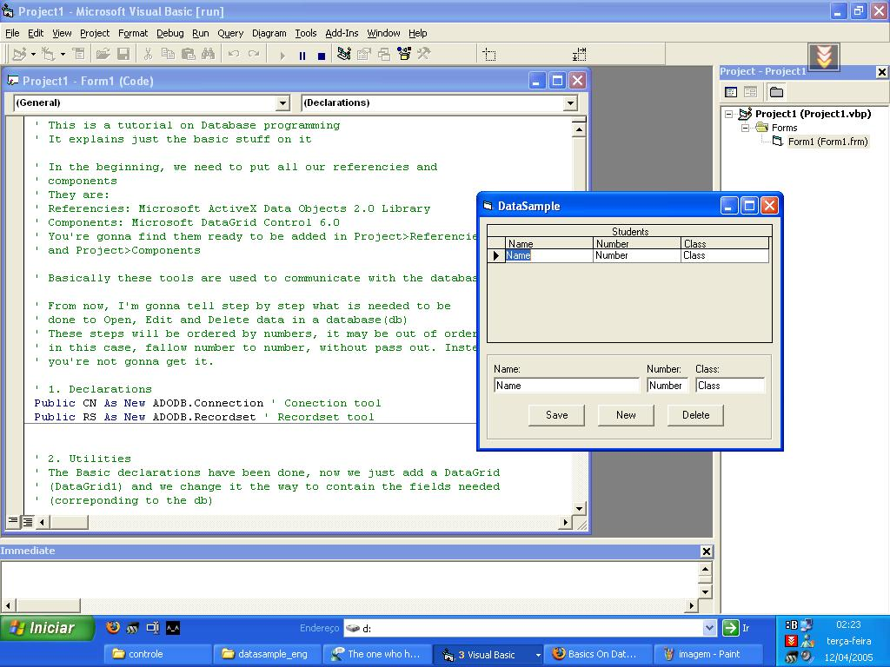



## Basics On Database

### Description

It explains the basics on Database managing with ADO using Datagrid.
 
### More Info
 

             |
---                |---
**Submitted On**   |2005-04-09 23:48:10
**By**             |[Diego Torquato](https://github.com/Planet-Source-Code/PSCIndex/blob/master/ByAuthor/diego-torquato.md)
**Level**          |Beginner
**User Rating**    |5.0 (15 globes from 3 users)
**Compatibility**  |VB 5\.0, VB 6\.0
**Category**       |[Databases/ Data Access/ DAO/ ADO](https://github.com/Planet-Source-Code/PSCIndex/blob/master/ByCategory/databases-data-access-dao-ado__1-6.md)
**World**          |[Visual Basic](https://github.com/Planet-Source-Code/PSCIndex/blob/master/ByWorld/visual-basic.md)
**Archive File**   |[Basics\_On\_1875724122005\.zip](https://github.com/Planet-Source-Code/diego-torquato-basics-on-database__1-59923/archive/master.zip)

